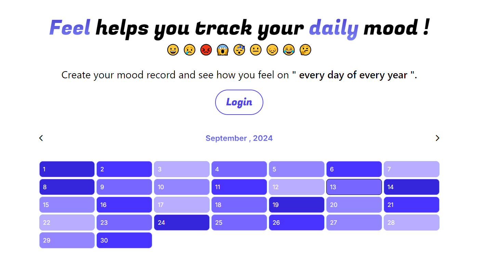

# 

# Feel - Mood Tracker

Feel is a user-friendly mood tracking app that helps you log your emotions daily and analyze mood patterns over time. It's designed to give you insights into your emotional well-being.

## Features

- **Daily Mood Logging**: Record your mood every day with a simple click.
- **Yearly Overview**: See your mood patterns across an entire year at a glance.
- **Multiple Mood Options**: Choose from a variety of emoji to accurately represent your feelings.
- **User-Friendly Calendar**: Navigate through months easily to log or review your moods.

